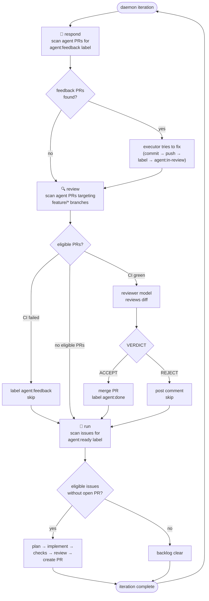

# Democracy Delicious Agent 🍕 🗳️

A cost-conscious, auditable autonomous development orchestrator for Pizza to the Polls.

The project is under active development. Core capabilities — credential verification, issue planning, implementation with checks and review, auto-discovery, and autonomous PR review with merge — are implemented.

## Daemon loop

The default command (`npm run agent`) runs a continuous pipeline:



Each iteration logs a structured timeline to `~/PizzaAgent/logs/daemon-YYYY-MM-DD.jsonl` for auditing.

## Architecture principles

- GitHub Issues and Projects are durable workflow state.
- Every coding task runs in an isolated worktree.
- Pi is the coding harness; OpenRouter models are selected explicitly by role.
- Coding workers never receive GitHub, AWS, or production credentials.
- The orchestrator performs deterministic Git and GitHub operations.
- Child PRs may integrate into an approved feature branch after automated review.
- Only a human reviews, approves, and merges the umbrella feature PR to `master`.
- Hard cost, turn, retry, concurrency, and wall-clock limits fail closed.

## Prerequisites

- Node.js 22
- A dedicated agent workspace containing clean clones and worktrees
- GitHub App installed on the three approved repositories
- Dedicated OpenRouter API key with a provider-side spending limit
- Protected local credential files described below

## Protected local files

These files are intentionally outside the repository:

```text
~/.config/democracy-delicious/github-app.pem
~/.config/democracy-delicious/env
```

Both must be owned by the macOS account running the orchestrator and mode `600`. The directory must be mode `700`.

The environment file format is:

```dotenv
OPENROUTER_API_KEY=...
```

Never commit or print either file.

## Install

```bash
git clone https://github.com/pizza-to-the-polls/democracy-delicious-agent.git
cd democracy-delicious-agent
nvm use
npm ci
```

## Verify the setup

```bash
npm test
npm run build
npm run agent -- doctor
```

`doctor` performs live GitHub and OpenRouter authentication checks but never prints credentials.

## Commands

```bash
npm run agent -- doctor
npm run agent -- --help

# Run the continuous daemon (discover → work → review → merge → repeat)
npm run agent                          # daemon mode (default)
npm run agent -- daemon --once         # single iteration
npm run agent -- daemon --dry-run      # plan only, no mutations
npm run agent -- daemon --poll 30      # faster polling when idle

# Inspect local agent state (locks, work state, worktrees, timeline, spend)
npm run agent -- status

# Reclaim stale locks and remove orphaned worktrees
npm run agent -- clean                 # orphaned worktrees + dead-holder locks
npm run agent -- clean --all           # also state files and session transcripts
npm run agent -- clean --dry-run       # preview only

# Run the daemon in multiple tabs — file-based locking prevents collisions
# Tab 1:  npm run agent
# Tab 2:  npm run agent
# Tab 3:  npm run agent

# Single-shot commands for debugging / manual use
npm run agent -- run                   # discover + work next issue
npm run agent -- run --dry-run         # discover only, no work
npm run agent -- review                # review + merge open agent PRs
npm run agent -- review --dry-run      # review only, no merge

# Plan and implement a specific approved issue
npm run agent -- work \
  --repo pizza-to-the-polls/pizzabase \
  --issue 152 \
  --dry-run

# Resume work on an issue after failure or repair
npm run agent -- work \
  --repo pizza-to-the-polls/pizzabase \
  --issue 152 \
  --resume

# Run autonomous review on open agent PRs targeting feature branches
npm run agent -- review
npm run agent -- review --dry-run
npm run agent -- review --repo pizza-to-the-polls/pizzabase
```

### `daemon` (default command) — continuous autonomous loop

Runs indefinitely (or once with `--once`): discovers `agent:ready` issues → implements them with the full `work` pipeline → creates PRs → reviews open agent PRs → merges accepted ones → sleeps `--poll` seconds → repeats. File-based locking (`~/PizzaAgent/locks/`) lets you run multiple daemon instances in separate terminals — they'll never collide on the same issue, and locks left behind by a crashed daemon are automatically reclaimed once their holder process is gone.

```bash
npm run agent                    # daemon mode (no subcommand needed)
npm run agent -- daemon --once   # one iteration then exit
npm run agent -- daemon --poll 30  # faster idle polling
```

### `run` — single-shot auto-discover and work

Scans approved repositories for issues labeled `agent:ready` that don't already have an open agent PR, picks the oldest, determines the integration branch (from labels or issue body), and delegates to `work`. Supports auto-resume if previous work was interrupted.

### `work` — plan, implement, review

Requires an open issue carrying `agent:ready`. Creates a clean clone and worktree under `~/PizzaAgent`; never uses the human's active application clones. Pipeline: plan (read-only) → implement → checks (format/lint/typecheck/test) → independent review → push + create PR targeting the feature integration branch. If checks or review fail, the worktree is retained for `--resume` repair.

### `review` — autonomous PR review and merge

Finds open agent PRs (`agent/*`) targeting `feature/*` branches. Runs the reviewer model against the diff, posts findings as a PR comment, and merges when VERDICT: ACCEPT and CI is green. PRs with human review comments are flagged with `agent:needs-human` and skipped — the respond loop never auto-fixes those; they require manual intervention. Updates linked issue labels (`agent:in-review` → `agent:done`).

### `status` — inspect local state (read-only)

Shows held locks (with PID liveness and age), saved per-issue work state with phase and spend, worktrees, session count, the latest timeline events, and current OpenRouter usage. Never talks to GitHub or spends model budget.

### `clean` — reclaim disk space and stale locks

Removes orphaned worktrees (whose git metadata was pruned) and locks whose holder process is no longer alive. With `--all`, also removes retained state files and session transcripts.

Maintainer-only bootstrap helper:

```bash
npm run agent -- post-instructions
```

That helper creates the setup issue from `docs/bootstrap-issue.md` using the GitHub App. It requires the local App credential.

## Configuration

Non-secret configuration is in [`config/agent.yml`](config/agent.yml). Runtime data is stored under `~/PizzaAgent` and is excluded from Git.

## Current status

Implemented:

- GitHub App JWT authentication
- automatic installation-token refresh with five-minute safety margin
- GitHub REST and GraphQL client foundation
- protected environment loading
- configuration validation
- system `doctor`
- isolated clean clones and issue worktrees
- explicit OpenRouter planner/executor/reviewer models through the Pi SDK
- dry-run planning
- local implementation with configured checks (format → lint → typecheck → test)
- independent review with VERDICT: ACCEPT/REJECT
- recovery journal with `--resume` repair cycles
- auto-discovery of `agent:ready` issues across repos (`run`)
- **continuous daemon mode** — default command, multi-instance safe via file locks with automatic stale-lock takeover
- child PR creation targeting feature integration branches
- autonomous PR review + merge (`review`)
- human-feedback response (`respond`) gated on local checks — nothing is pushed unless format/lint/typecheck/test pass locally
- `agent:needs-human` escalation strictly honored (never auto-fixed)
- bounded repair cycles enforced via `limits.maxRepairCycles`
- read-only state inspection (`status`) and workspace cleanup (`clean`)
- linked issue label management
- test suite (59 tests, 0 failures)
- bootstrap issue template

Not enabled yet:

- Staging deployment

See the organization Project for planned work:

https://github.com/orgs/pizza-to-the-polls/projects/1
